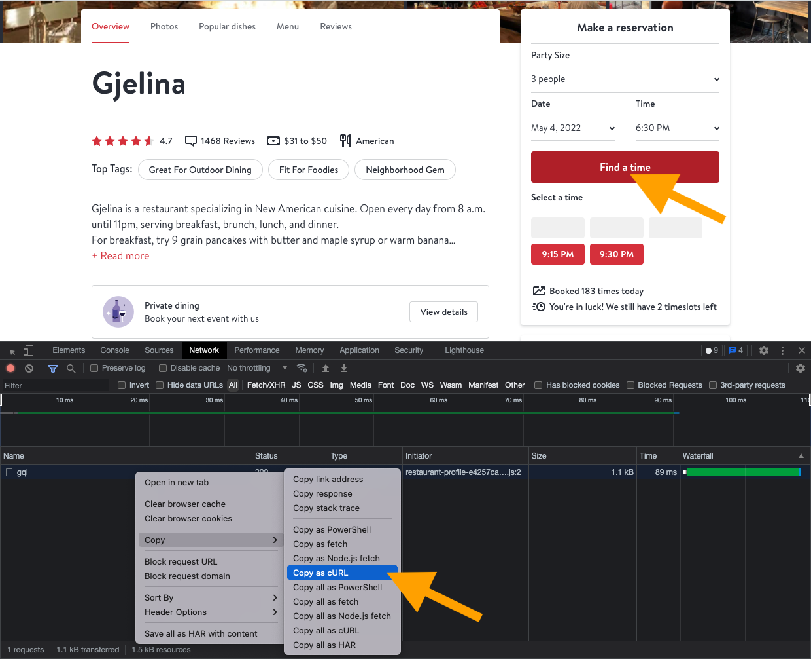

# Open Table Listener

This project pings Open Table to check whether a given restaurant reservation search has changed.

## Deployment

This project is designed to be deployed to an Amazon EC2, a DigitalOcean droplet, or the like.

```
git clone https://github.com/mokolodi1/open-table-listener/
cd open-table-listener
```

## Setup

First, grab the network call from Open Table using the following method.



Copy that cURL command into `open_table_curl.sh`. This is in a separte file in order to not reveal my cookies to GitHub.

## Usage

Launch the following command in a `tmux` window to ensure it keeps running when `ssh` window is closed.

```
SMS_NUMBER="+1609XXXXXXX" SMS_MESSAGE="https://www.opentable.com/gjelina" TWILIO_SID="XXX" TWILIO_AUTH="XXX" watch -n 60 ./check_gjelina_tonight.sh
```

### Variables

`SMS_NUMBER` is the number you'd like to text.

`SMS_MESSAGE` is the message that will be sent.

`TWILIO_SID` and `TWILIO_AUTH_TOKEN` can be fetched from [the Twilio console page](https://console.twilio.com/).

## Important notes

You may receive a single text when you launch the command if it's the first time you're checking a given reservation.
